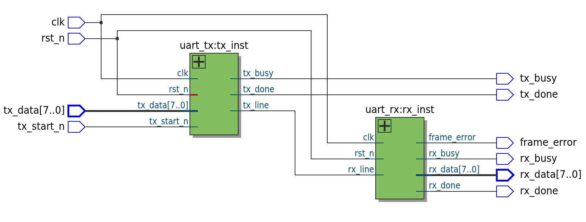
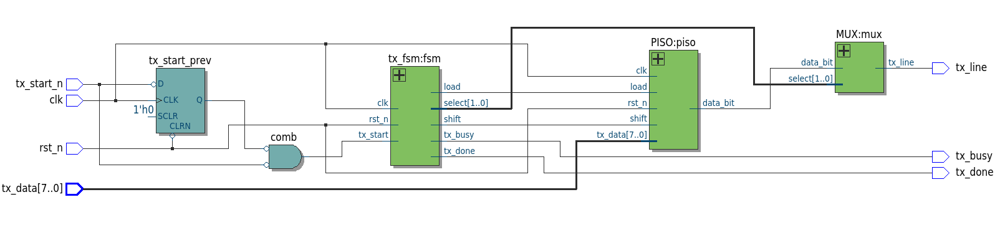
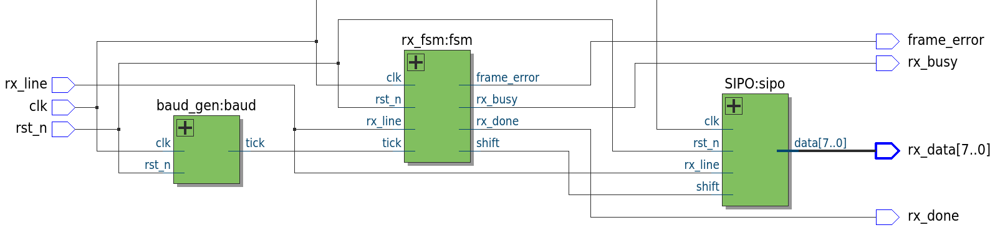
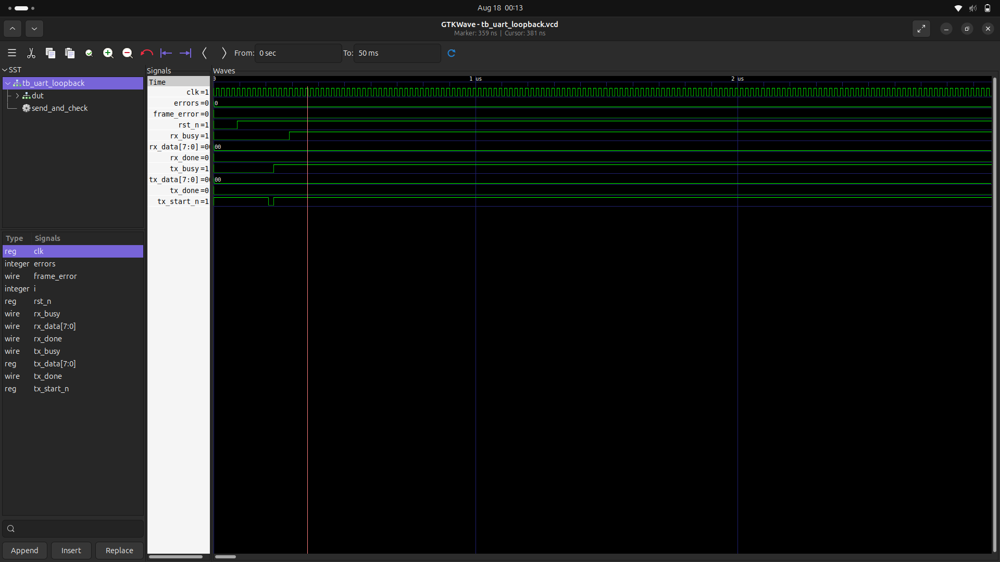

# UART TX/RX on DE0-Nano (Cyclone IV E)

A structural, FSM+Datapath UART transmitter and receiver in Verilog, synthesized and verified on real hardware (Terasic DE0-Nano, Cyclone IV EP4CE22F17C6) via an on-chip loopback test.

Beyond the RTL, it covers the full RTL-to-bitstream flow: timing closure, pin planning, active-low I/O handling, and fixing a Linux USB-Blaster permissions issue.

---

## Overview

| | |
|---|---|
| **Target board** | Terasic DE0-Nano |
| **FPGA** | Cyclone IV E, EP4CE22F17C6 |
| **Toolchain** | Quartus Prime Lite 25.1 |
| **Clock** | 50 MHz onboard oscillator |
| **Baud rate** | 9600 (parameterized) |
| **RX oversampling** | 16x |
| **HDL** | Verilog-2001, structural (no behavioral shortcuts) |

TX and RX are built and tested independently, then combined into a single `uart_loopback` top-level for full-path, on-chip verification — no external wiring required.

---

## Architecture

Both cores separate **control** (FSM) from **data** (PISO/SIPO datapath modules), with the FSM driving simple `load`/`shift`/`select` signals rather than touching registers directly.

```
                         uart_loopback
        ┌─────────────────────────────────────────────────┐
        │   ┌───────────┐                 ┌───────────┐    │
tx_data─┼──▶│  uart_tx  │──tx_line (int.)─▶│  uart_rx  │────┼─▶ rx_data[7:0]
tx_start┼──▶│           │                  │           │────┼─▶ rx_done
        │   └───────────┘                  └───────────┘────┼─▶ frame_error
        └─────────────────────────────────────────────────┘
```

**`uart_tx`**: `tx_fsm` (IDLE → START → DATA → STOP) drives a PISO shift register and a MUX that selects the start bit, data bit, or stop bit onto `tx_line`.

**`uart_rx`**: a free-running `baud_gen` produces 16 ticks per bit period; `rx_fsm` detects the start-bit edge, validates it at mid-bit to reject glitches, samples each data bit at its midpoint, and checks the stop bit for framing errors. A SIPO register reassembles the byte.

### RTL Schematics (Quartus RTL Viewer)

**Top-level loopback** — `uart_tx` and `uart_rx` wired internally, no external pins between them:



**`uart_tx`** — FSM driving a PISO shift register and output MUX, with the edge-detector (`tx_start_prev` flip-flop + AND gate) visible as distinct synthesized hardware:



**`uart_rx`** — `baud_gen`, `rx_fsm`, and `SIPO` wired together, matching the control/datapath split described above:



---

## Design Details

- **Frame format**: 1 start bit (0) → 8 data bits, LSB first → 1 stop bit (1). No parity.
- **TX timing**: `CYCLES_PER_BIT = CLK_FREQ / BAUD_RATE` ≈ 5208 cycles/bit at 9600 baud, counted directly by the FSM.
- **RX timing**: `baud_gen` ticks every ≈325 cycles (16×325 = 5200 vs. the true 5208 — a ~0.15% error, well within UART tolerance).
- **RX bit recovery**: start bit detected on `rx_line` every clock cycle (async to internal timing), reconfirmed at tick 8, then sampled every 16 ticks thereafter.

---

## Repository Structure

```
uart-de0-nano/
├── README.md
├── rtl/            # tx_fsm, PISO, MUX, uart_tx, baud_gen, rx_fsm, SIPO, uart_rx, uart_loopback
├── constraints/     # uart_tx.sdc, pin_assignments.md
└── docs/            # RTL schematics, waveform screenshots
```

---

## Build & Program

1. Quartus Prime Lite (25.1+), device **Cyclone IV E / EP4CE22F17C6**.
2. Add all files from `rtl/`, set `uart_loopback` as top-level.
3. Add the SDC constraint (critical — see [Timing Closure](#timing-closure)):
   ```tcl
   create_clock -period 20.000 -name clk [get_ports clk]
   derive_clock_uncertainty
   ```
4. Assign pins per `constraints/pin_assignments.md`, I/O standard **3.3-V LVTTL**.
5. **Processing → Start Compilation**, then **Tools → Programmer** to flash the `.sof`.

**Linux USB-Blaster fix** (if Quartus shows the device via `lsusb` but programming fails):
```bash
sudo tee /etc/udev/rules.d/51-usbblaster.rules << 'EOF'
SUBSYSTEM=="usb", ATTR{idVendor}=="09fb", MODE="0666"
EOF
sudo udevadm control --reload-rules && sudo udevadm trigger
```
Unplug/replug the board afterward.

---

## Bugs Found & Fixed

Selected debugging highlights (full list in commit history):

| Issue | Fix |
|---|---|
| Reset polarity inverted | `if (rst_n)` → `if (!rst_n)` for active-low async reset |
| Off-by-one bit/tick counting | Compare to `N-1`, not `N`, when counting from 0 |
| `shift` pulse never returned to 0 | Explicitly drive `0` in every non-triggering branch |
| `$clog2()` misused as a cycle count | It gives bit-width, not the count — baud rate was ~400x too fast |
| Active-low button read as active-high | Inverted (`~tx_start_n`) before use |
| Held button re-triggered FSM | Added edge detector for a single one-cycle pulse |
| Missing `.sdc` | Timing Analyzer defaulted to a fictitious 1 GHz clock, failed by −1.66 ns; fixed with correct 50 MHz constraint |
| USB-Blaster detected but programming failed on Linux | Missing udev rule for non-root USB access |

---

## Timing Closure

Without an `.sdc`, Quartus assumes a 1 GHz clock and reports failing timing — a tooling default, not a design flaw. With the correct 50 MHz constraint, post-fit results across all corners show **positive slack** (worst case +0.187 ns hold, +15.71 ns setup), comfortable margin for a design this small.

---

## Resource Utilization

| Design | Logic cells | Input pins | Output pins |
|---|---|---|---|
| `uart_tx` only | 54 | 11 | 3 |
| `uart_loopback` (TX+RX) | 113 | 11 | 13 |

Under 1% of the EP4CE22's ~22,320 logic elements.

---

## Verification

- **Standalone TX**: button-triggered transmission confirmed via `tx_busy`/`tx_done` LEDs.
- **Full loopback**: TX wired internally to RX on-chip; `rx_data` confirmed to match switch-set `tx_data`, `rx_done` pulsing, no `frame_error`.
- **RTL schematic review**: Quartus RTL Viewer used to confirm each module elaborated into distinct hardware (e.g., the edge-detector flip-flop + AND gate).
### GTKWave Simulation



TX and RX bit timing, `shift`/`load` pulses, and the full byte-in → byte-out loopback path observed in simulation.

---

